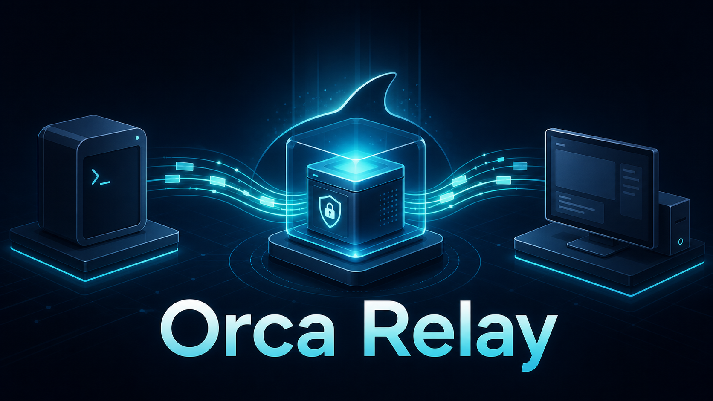
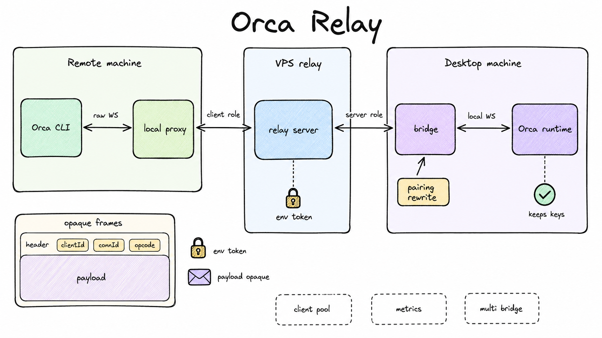
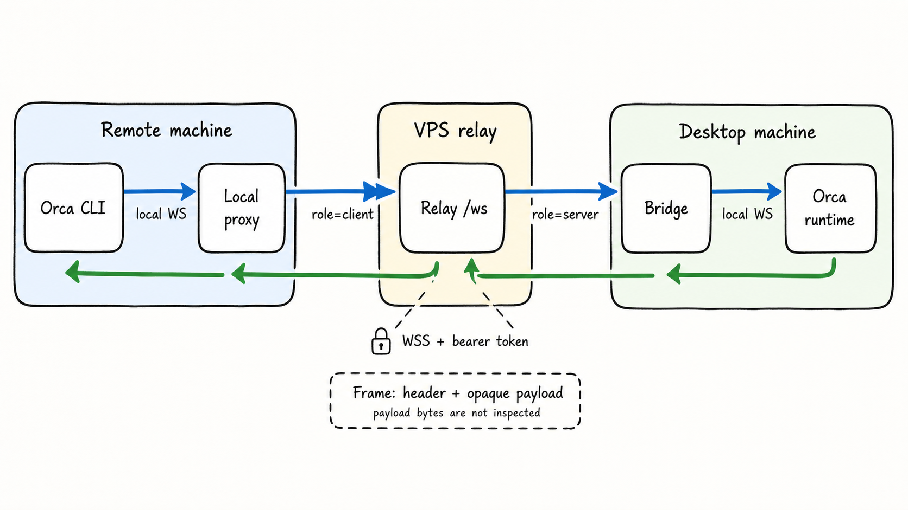

# Orca Relay：让 Orca CLI 通过 VPS 访问桌面端运行时

[English](README.md) | 简体中文



> 无需修改 Orca app bundle，也能让远端 Orca CLI 通过 VPS 中继连接桌面端 Orca runtime。

Orca Relay 是一层轻量 WebSocket 中继适配器。远端机器上的 Orca CLI 连接本机 `orca-relay-proxy`，proxy 把原始 WebSocket 消息封装成不透明 adapter frame 后穿过 VPS 上的 `orca-relay`，再由桌面端附近的 `orca-relay-bridge` 转发给真正的本机 Orca runtime。

Orca Relay 不修改 Orca、不解析 Orca RPC、不查看业务 payload。它只提供一条网络路径。

## 当前范围

已包含：

- `orca-relay`：部署在 VPS 上的 WebSocket 中继服务，提供 `/health` 和 `/ws`。
- `orca-relay-proxy`：运行在远端 Orca CLI 机器上的本地 WebSocket 代理。
- `orca-relay-bridge`：运行在能访问桌面端 Orca runtime 的机器上的桥接进程。
- `orca-relay rewrite-pairing-code`：只改写配对码 `endpoint` 的辅助命令。
- 本地契约测试：覆盖 relay 路由、adapter frame 转发、配对码改写。

暂不包含：

- 不修改 Orca app bundle。
- 不解析 Orca RPC、不检查 payload、不为 payload 新增加密层、不重新生成 Orca 凭据。
- 不提供持久客户端池、账号系统、限流、审计日志或多租户授权。
- 目前不是 crates.io 包；`Cargo.toml` 中 `publish = false`。

## 架构速览



```text
远端机器                      VPS                      桌面机器
Orca CLI -> local proxy  ->  relay /ws  ->  bridge  ->  local Orca runtime
          原始 WS             adapter frames          原始 WS
```

典型流程：

1. `orca-relay-bridge` 在桌面端附近启动，作为 `role=server` 连接 VPS relay。
2. `orca-relay-proxy` 在远端 CLI 机器启动，监听一个本地 WebSocket endpoint。
3. `orca-relay rewrite-pairing-code` 只把 Orca 配对码里的 `endpoint` 改成本地 proxy endpoint，同时保留 `deviceToken` 和 `publicKeyB64`。
4. Orca CLI 像连接 runtime 一样连接本地 proxy。
5. Proxy 和 bridge 负责封装/恢复 WebSocket 的 `text`、`binary`、`close` 消息；VPS relay 只按 `serverId` 和 `clientId` 路由。

## 工作方式



### `orca-relay`：VPS 中继服务

`orca-relay` 部署在 VPS 上，通常放在 Caddy/Nginx 等 TLS 反向代理后面。它提供：

- `GET /health`：不需要认证的健康检查和版本信息。
- `GET /ws`：需要认证的 WebSocket 中继入口。

`/ws` 要求 `Authorization: Bearer $ORCA_RELAY_TOKEN`、`v=1`、`serverId`，并且二选一：

- `role=server`：bridge 侧连接。
- `role=client&clientId=<client-id>`：proxy 侧连接。

Relay 为每个 `serverId` 保留一条 active server socket，并按 `clientId` 把响应路由回对应 client。如果 client 在 bridge 连接前进入，会快速返回 service unavailable，而不是挂起。

### `orca-relay-proxy`：CLI 侧本地代理

`orca-relay-proxy` 运行在使用 Orca CLI 的远端机器上。它：

- 监听本机 `/ws`。
- 接收 Orca CLI 的原始 WebSocket。
- 作为 `role=client` 连接 VPS relay。
- 把本地 WebSocket message 封装成 adapter frame。
- 把 bridge 返回的 frame 恢复成 Orca CLI 期望的 WebSocket message。

Relay token 只能从 `ORCA_RELAY_TOKEN` 环境变量读取。

### `orca-relay-bridge`：runtime 侧桥接进程

`orca-relay-bridge` 运行在桌面机器上，或任何能访问本机 Orca runtime WebSocket 的主机上。它：

- 作为 `role=server` 持有一条到 VPS relay 的长连接。
- 为每个中继过来的 `connectionId` 打开一条本机 Orca runtime WebSocket。
- 把 runtime 回复封装后发回 relay。
- 如果无法连接本机 runtime，会向远端关闭连接，close code 为 `1013`，reason 为 `local runtime unavailable`。

Relay token 只能从 `ORCA_RELAY_TOKEN` 环境变量读取。

## Adapter 帧格式

Proxy 与 bridge 之间通过 relay 携带的每个 payload 都是二进制 adapter frame：

```text
[u32 big-endian header_len][header_json][opaque_payload]
```

`header_json` 使用 camelCase 字段：

| 字段 | 含义 |
| --- | --- |
| `clientId` | relay 用来路由 server 回复的 client 标识。 |
| `connectionId` | proxy/bridge 用来区分端到端 WebSocket 连接的标识。 |
| `direction` | `client_to_server` 或 `server_to_client`。 |
| `opcode` | 原始 WebSocket message 类型：`text`、`binary` 或 `close`。 |
| `closeCode`、`closeReason` | close frame 的可选元数据。 |

`header_json` 后面的字节就是原始 WebSocket payload。VPS relay 只解析路由所需的 header 字段，不检查、不解密、不转换、不记录 Orca 业务 payload。

## 快速开始

需要三台/三类机器：

1. **VPS relay**：运行 `orca-relay`，由 TLS 反向代理公开。
2. **桌面/runtime 侧**：运行 `orca-relay-bridge`，能访问真正的 Orca runtime。
3. **远端 CLI 侧**：运行 `orca-relay-proxy`，让 Orca CLI 连接它的本地 endpoint。

三侧共用一个 relay token：

```sh
export ORCA_RELAY_TOKEN='<your-relay-token>'
```

`serverId` 和 `clientId` 是路由标识，不是 secret：

```sh
export ORCA_RELAY_SERVER_ID='desktop-orca'
export ORCA_RELAY_CLIENT_ID='remote-cli-1'
export ORCA_RELAY_URL='wss://<your-relay-domain.example>/ws'
```

## 通过 GitHub Release 安装

### 预编译二进制

GitHub release `v0.1.0` 发布一个 Linux x86_64 预编译 tarball：

```text
orca-relay-v0.1.0-x86_64-unknown-linux-musl.tar.gz
orca-relay-v0.1.0-x86_64-unknown-linux-musl.tar.gz.sha256
```

每个归档包含：

- `orca-relay`
- `orca-relay-proxy`
- `orca-relay-bridge`

未来如增加其他 target，应沿用同一命名模式：`orca-relay-v0.1.0-<target>.tar.gz`。解压前先校验配套 checksum 文件：

```sh
TARGET='x86_64-unknown-linux-musl'
BASE_URL='https://github.com/JonesZeng/orca-relay/releases/download/v0.1.0'

curl -fLO "$BASE_URL/orca-relay-v0.1.0-$TARGET.tar.gz"
curl -fLO "$BASE_URL/orca-relay-v0.1.0-$TARGET.tar.gz.sha256"
sha256sum -c "orca-relay-v0.1.0-$TARGET.tar.gz.sha256"
tar -xzf "orca-relay-v0.1.0-$TARGET.tar.gz"
```

下面的 VPS 安装器默认使用同一套 release 产物命名。只有需要显式指定仓库时才设置 `ORCA_RELAY_GITHUB_REPO=JonesZeng/orca-relay`；它已经是安装器默认值。

## VPS 部署

### 用 agent 一键部署

`skills/deploy-orca-relay/SKILL.md` 是一份写给 coding agent 的自包含部署 runbook：它会先把缺失信息问清楚，根据你有没有自己的域名选择拓扑，然后依次完成 VPS 中继安装、bridge 与 proxy 启动、配对码改写，最后装上本地稳定性层。每个阶段都有验证关卡，agent 必须把输出给你看过才能继续。

`skills/configure-orca-relay-clients/SKILL.md` 是面向新用户完整路径的后续 runbook：开发机 `orca serve` + bridge、个人 VPS 中继/公网 proxy，以及只靠配对码接入的 Win / Mac / Mobile 客户端。当「VPS 已装好」还不够、agent 仍不清楚客户端怎么配对时，用这份技能。

把技能放到你的 agent 加载位置即可，例如 `.claude/skills/<name>/SKILL.md`、`.agents/skills/<name>/SKILL.md` 或 `~/.agents/skills/<name>/SKILL.md`。如果你的 agent 没有技能机制，直接贴下面其中一段 prompt：

```text
读取 orca-relay 仓库里的 skills/deploy-orca-relay/SKILL.md，然后帮我部署 Orca Relay。
我有一台 Linux VPS（ssh host: <vps-host>），域名情况是 <有域名: your-relay-domain.example | 没有域名>。
Orca runtime 跑在 <runtime-host> 的 <orca-runtime-port> 端口，Orca CLI 跑在 <client-host>。
缺什么信息先问我；任何会写入系统的安装之前先跑安装器的 `render` 预览；
每个验证关卡都停下来把输出给我看；任何情况下都不要把 relay token 打印出来。
```

```text
读取 skills/configure-orca-relay-clients/SKILL.md 和 skills/deploy-orca-relay/SKILL.md。
按这条路径配置：开发机 Orca server + orca-relay-bridge → 个人 VPS orca-relay
→ Win/Mac/Mobile 用配对码接入。
已知信息：VPS ssh=<vps-host>，域名=<your-relay-domain.example>，runtime 主机=<runtime-host>，
runtime 端口=<orca-runtime-port>，客户端=<mobile|mac|win|cli>。
缺什么先问我；任何情况下都不要打印 ORCA_RELAY_TOKEN 或完整配对码；
每个验证关卡都停下来，只展示脱敏后的证据。
```

下面的手工步骤就是这个技能实际驱动的流程，你也可以照着自己一步步做。

### 一条命令部署 VPS 中继

对于 GitHub release `v0.1.0`，推荐的 VPS 安装入口会从 `JonesZeng/orca-relay` 下载预编译的 `orca-relay-v0.1.0-<target>.tar.gz` 产物：

```sh
curl -fsSL "https://raw.githubusercontent.com/JonesZeng/orca-relay/v0.1.0/scripts/install-vps.sh" \
  | sudo bash -s -- install \
      --domain '<your-relay-domain.example>' \
      --bind '127.0.0.1:8080' \
      --version 'v0.1.0' \
      --caddy-mode managed
```

安装器负责：

- 安装 release 产物到 `/opt/orca-relay/`，并维护 `current` symlink。
- 写入 `/etc/orca-relay/orca-relay.env`，包含 `ORCA_RELAY_BIND`、`ORCA_RELAY_TOKEN`、`RUST_LOG`。
- 写入 `/etc/systemd/system/orca-relay.service`。
- 可选写入 Caddy 站点，把公网域名反向代理到本机 loopback relay。
- 修改前创建 rollback snapshot。

Token 规则：

- 不存在 `--token` 参数。
- 复用已有 token 时使用 `ORCA_RELAY_TOKEN_FILE=/root/orca-relay-token`。
- 如果没有提供 token 来源，安装器会在 VPS 本地生成 token，并只写入 env 文件。
- `render` / `--dry-run` 输出必须隐藏 token 内容。

使用已有 token 文件：

```sh
curl -fsSL "https://raw.githubusercontent.com/JonesZeng/orca-relay/v0.1.0/scripts/install-vps.sh" \
  | sudo env ORCA_RELAY_TOKEN_FILE='/root/orca-relay-token' \
      bash -s -- install \
        --domain '<your-relay-domain.example>' \
        --bind '127.0.0.1:8080' \
        --version 'v0.1.0' \
        --caddy-mode managed
```

如果你已经有 Nginx/Caddy/Traefik 或平台托管 TLS：

```sh
curl -fsSL "https://raw.githubusercontent.com/JonesZeng/orca-relay/v0.1.0/scripts/install-vps.sh" \
  | sudo bash -s -- install \
      --bind '127.0.0.1:8080' \
      --version 'v0.1.0' \
      --caddy-mode skip
```

Pipe-to-root 安装器需要信任边界。公开使用时请固定 release tag，必要时先审阅 `scripts/install-vps.sh`，或改用上面已校验的 release 产物手动安装。

### 手动部署布局

推荐 VPS 文件布局：

```text
/opt/orca-relay/current/orca-relay          # systemd 启动的二进制
/etc/orca-relay/orca-relay.env             # root 管理的环境文件
/etc/systemd/system/orca-relay.service     # systemd 服务
/etc/caddy/conf.d/orca-relay.caddy         # 可选 Caddy 站点
/var/lib/orca-relay/                       # 状态与安装器快照
```

环境文件示例：

```dotenv
ORCA_RELAY_BIND=127.0.0.1:8080
ORCA_RELAY_TOKEN=<your-relay-token>
RUST_LOG=info
```

Caddy 示例：

```caddyfile
<your-relay-domain.example> {
    encode zstd gzip

    reverse_proxy 127.0.0.1:8080 {
        header_up Host {host}
        header_up X-Forwarded-Proto {scheme}
        header_up X-Forwarded-For {remote_host}
    }
}
```

Rust relay 应只监听 loopback。公网只开放 TLS 反向代理的 `80/tcp` 和 `443/tcp`。

端口注意：早期部署记录中，某个线上 origin 使用 `127.0.0.1:6769`；当前仓库 env/Caddy 模板和 server 默认值使用 `127.0.0.1:8080`。两者都可以作为本机监听地址，但部署时必须让 `ORCA_RELAY_BIND`、Caddy `reverse_proxy` 和实际运行服务保持一致。

## 启动桌面端 bridge

在能访问真实 Orca runtime WebSocket 的桌面机器或同网段主机上运行：

```sh
export ORCA_RELAY_URL='wss://<your-relay-domain.example>/ws'
export ORCA_RELAY_SERVER_ID='desktop-orca'
export ORCA_RUNTIME_WS_URL='ws://127.0.0.1:<orca-runtime-port>/ws'
export ORCA_RELAY_TOKEN='<your-relay-token>'

orca-relay-bridge
```

非 secret 参数也可以用 flag 传入：

```sh
orca-relay-bridge \
  --relay-url "$ORCA_RELAY_URL" \
  --runtime-url "$ORCA_RUNTIME_WS_URL" \
  --server-id "$ORCA_RELAY_SERVER_ID"
```

不要把 relay token 写进命令行参数。

## 启动远端本地 proxy

在运行 Orca CLI 的远端机器上运行：

```sh
export ORCA_RELAY_URL='wss://<your-relay-domain.example>/ws'
export ORCA_RELAY_SERVER_ID='desktop-orca'
export ORCA_RELAY_CLIENT_ID='remote-cli-1'
export ORCA_RELAY_BIND='127.0.0.1:17777'
export ORCA_RELAY_TOKEN='<your-relay-token>'

orca-relay-proxy
```

非 secret 参数也可以用 flag 传入：

```sh
orca-relay-proxy \
  --bind "$ORCA_RELAY_BIND" \
  --relay-url "$ORCA_RELAY_URL" \
  --server-id "$ORCA_RELAY_SERVER_ID" \
  --client-id "$ORCA_RELAY_CLIENT_ID"
```

启动后使用它打印的本地 URL，通常是 `ws://127.0.0.1:17777/ws`，作为配对码的新 endpoint。

## 改写配对码 endpoint

Orca 配对码包含 endpoint 和敏感配对材料。重写命令只修改 `endpoint`；它会保留 `deviceToken` 和 `publicKeyB64`，并校验 pairing payload 版本为 `2`。

支持输入：

- 裸 URL-safe base64 pairing payload。
- `orca://pair?...` link。
- 包含 `#pairing=` 的 Orca Desktop browser URL。

示例：

```sh
orca-relay rewrite-pairing-code \
  --endpoint 'ws://127.0.0.1:17777/ws' \
  '<pairing-code-or-link>'
```

不要把真实配对码、`deviceToken` 或 `publicKeyB64` 粘贴到 GitHub issue、日志或截图里。

## 安全边界

- `ORCA_RELAY_TOKEN` 用于 relay WebSocket 访问控制。它只能来自环境变量或环境文件；二进制不接受 token CLI flag。
- 任何拿到 `ORCA_RELAY_TOKEN` 的人都可以加入这个 relay 信任域。当前代码没有实现 per-client token、token 过期、token 哈希、mTLS、Origin 白名单、限流或按 `serverId` 授权。
- 公网 relay URL 应使用 `wss://`，由 Caddy/Nginx 等终止 TLS。
- Relay origin 应保持 loopback 监听。
- Payload 对 Orca Relay 不透明。这里的“不透明”不等于本项目提供加密。
- 配对码重写保留 Orca credential 字段。这是兼容性要求，不是新的安全保证。

## 运维检查与延迟排查

健康检查：

```sh
curl -fsS 'https://<your-relay-domain.example>/health'
curl -fsS 'http://127.0.0.1:8080/health'
```

辅助脚本：

| 脚本 | 用途 |
| --- | --- |
| `scripts/measure-relay-ws-latency.py` | 测量 TCP、TLS、WebSocket open、relay frame round trip。`ORCA_RELAY_TOKEN` 只能来自环境变量。 |
| `scripts/cloudflare-relay-mode.sh` | 检查或切换 Cloudflare DNS-only / proxied 模式。默认 dry-run，只有 `--apply` 才修改。 |
| `scripts/compare-cloudflare-relay-latency.sh` | 组合前两个脚本对比灰云/橙云路径延迟。 |
| `scripts/test_support_scripts.py` | 本地检查 frame 构造、token redaction、脚本安全默认值。 |
| `scripts/orca-relay-soft-death-probe.sh` | 仅取证的 soft-death 探活。采样 TCP Send-Q / bytes / lastrcv，在 warn/crit 时冻结本地+远端快照；**不重启**任何服务。 |
| `scripts/orca-relay-bridge-watchdog.sh` | 本地连通性 watchdog。在路径死亡或 soft-wedge 时重启 headless `orca serve` runtime 和/或 bridge；**不**重启远端/公网 proxy。 |
| `scripts/orca-relay-watchdog-daemon.sh` | watchdog 循环的脱离终端单实例守护器。用 `setsid` 加 `flock` 锁，保证退出终端/tmux/SSH 后仍存活，且不会重复启动。 |
| `scripts/restart-orca-relay-mobile.sh` | 运维一键全量重启：远端 relay/proxy 单元 + 本地 Xvfb/Electron serve + pairing-code 刷新 + 公网健康/WS 检查。 |

### Soft-death 探活与本地 watchdog

进程级健康（`bridge pid` + `:443 ESTAB` + 公网 `/health`）可能仍然是绿的，但应用会话已经卡死。soft-death 工具覆盖这个缺口：

```sh
# 仅取证（可长期挂着）
bash scripts/orca-relay-soft-death-probe.sh --once --json
bash scripts/orca-relay-soft-death-probe.sh --loop

# 本地修复循环（永不重启远端 proxy）
bash scripts/orca-relay-bridge-watchdog.sh --status --json
bash scripts/orca-relay-bridge-watchdog.sh --loop

# 同一个循环，脱离终端且单实例（退出终端/tmux 也不会死）
bash scripts/orca-relay-watchdog-daemon.sh start
bash scripts/orca-relay-watchdog-daemon.sh status
bash scripts/orca-relay-watchdog-daemon.sh stop

# 手动全量重启（远端 proxy + 本地 runtime）
bash scripts/restart-orca-relay-mobile.sh
```

推荐运维拆分：

1. 用 `orca-relay-soft-death-probe.sh --loop` 做证据采集。
2. 用 `orca-relay-bridge-watchdog.sh --loop` 做本地自动修复（只动 runtime/bridge）；无人值守场景用 `orca-relay-watchdog-daemon.sh start` 拉起。
3. 只有在你明确要弹远端路径时才用 `restart-orca-relay-mobile.sh`。

当前 `orca serve` CLI 不接受 relay 参数，也不再托管 bridge，所以 watchdog 把 runtime 和 bridge 当成两个独立 tmux 服务来看（默认 `orca-server-relay` 和 `orca-relay-bridge`），只重启真正挂掉的那一个。

三个脚本都从 `ORCA_RELAY_ENV_FILE`（默认 `/root/.config/orca/orca-relay.env`）读取持久化的 relay 身份，并支持 `ORCA_*` 覆盖 bridge 路径、健康 URL、远端主机和阈值。默认值指向本地开发路径（如 `target/release/orca-relay-bridge`）以及占位符 `https://<your-relay-domain.example>/health`。

开发期间记录过的公开部署事实是 `wss://relay-orca.lucaszen.dpdns.org/ws`，Cloudflare DNS-only（灰云）模式。把它视为部署示例，不要当成公共共享服务承诺。

## 常见问题排查

| 症状 | 可能层级 | 检查点 |
| --- | --- | --- |
| `missing ORCA_RELAY_TOKEN` | 进程环境 | 在 service env 文件或 shell 中设置 `ORCA_RELAY_TOKEN`；不要用 flag。 |
| WebSocket upgrade 返回 401 | Relay auth | Relay、proxy、bridge 必须使用完全一致的 bearer token。 |
| WebSocket upgrade 返回 503 | 对应 `serverId` 没有 bridge | 启动 `orca-relay-bridge`；确认 proxy 和 bridge 使用同一个 `ORCA_RELAY_SERVER_ID`。 |
| 公网 `/health` 失败但 service active | 反向代理 / bind | 确认 Caddy `reverse_proxy` 与 `ORCA_RELAY_BIND` 一致。 |
| Bridge 已连接但 CLI 没响应 | 本机 Orca runtime | 确认 bridge 主机能访问 `ORCA_RUNTIME_WS_URL`。 |
| close code `1013`，reason `local runtime unavailable` | Bridge 到 runtime | 启动 Orca runtime 或修正 runtime URL。 |
| 配对码改写失败 | Pairing payload | 输入必须是支持形态、版本 `2`，并包含 `endpoint`、`deviceToken`、`publicKeyB64`。 |
| CLI 连错端口 | Proxy bind / pairing endpoint | 使用 `orca-relay-proxy` 打印的 `ws://.../ws`，或设置稳定 `--bind`。 |
| Cloudflare 橙云模式行为变化 | Cloudflare edge path | 先用 DNS-only 灰云建立 baseline，再单独验证橙云 WebSocket/TLS。 |
| `adapter text payload was not UTF-8` | Adapter opcode mismatch | 非 UTF-8 字节必须作为 WebSocket binary frame 发送，而不是 text frame。 |
| Bridge 进程 + `:443 ESTAB` 看起来健康，但客户端卡住 | Soft-death / 会话卡死 | 跑 `scripts/orca-relay-soft-death-probe.sh --once --json`。高 Send-Q 且 `bytes_sent` 不涨、`lastrcv` 升高、或 bridge 没有 `:443` 是主要信号。 |
| 主机重启后本地 runtime 端口 `:6768` 掉线 | 本地 headless serve | 用 `scripts/orca-relay-bridge-watchdog.sh`（runtime 修复）或 `scripts/restart-orca-relay-mobile.sh` 做全量重启。 |

## 从源码构建

预编译 release 二进制是普通安装路径。只有在没有匹配的发布目标平台、需要本地补丁，或你想自己审计构建产物时，才需要从源码构建：

```sh
cargo build --release
```

本地 release 二进制：

- `target/release/orca-relay`
- `target/release/orca-relay-proxy`
- `target/release/orca-relay-bridge`

对于静态 Linux 构建，取决于构建方式，本仓库本地也可能出现 `target/x86_64-unknown-linux-musl/release/` 输出。不要在公开 release 自动化中依赖本地 `target/` 目录；应发布明确的 GitHub Release 产物和 checksum 文件。

## 验证

贡献者 release gate：

```sh
cargo test && cargo fmt --check && cargo clippy --all-targets --all-features -- -D warnings && python3 scripts/test_support_scripts.py && python3 -m py_compile scripts/measure-relay-ws-latency.py scripts/test_support_scripts.py && bash -n scripts/cloudflare-relay-mode.sh scripts/compare-cloudflare-relay-latency.sh scripts/install-vps.sh scripts/orca-relay-bridge-watchdog.sh scripts/orca-relay-soft-death-probe.sh scripts/restart-orca-relay-mobile.sh
```

这能证明：

- Rust relay contract、adapter proxy/bridge contract、配对码改写行为在本地通过。
- Rust 代码格式和 Clippy 检查通过。
- 支持脚本能解析，并保留 token-handling guardrails。
- Shell 脚本语法有效。

它不能单独证明：

- 某个公网 relay URL 当前可达。
- 真实 Orca Desktop bundle 或 live Orca CLI 已经跑过。
- 某台 VPS 的 Cloudflare/DNS/TLS 配置正确。
- 已经采集真实延迟数据。

## 仓库结构

```text
orca-relay/
├── Cargo.toml
├── src/
│   ├── lib.rs
│   ├── main.rs
│   └── bin/
│       ├── orca-relay-proxy.rs
│       └── orca-relay-bridge.rs
├── tests/
│   ├── relay_contract.rs
│   ├── adapter_contract.rs
│   └── pairing_code.rs
├── scripts/
│   ├── install-vps.sh
│   ├── orca-relay.env.example
│   ├── orca-relay.service.template
│   ├── Caddyfile.orca-relay.template
│   ├── measure-relay-ws-latency.py
│   ├── cloudflare-relay-mode.sh
│   ├── compare-cloudflare-relay-latency.sh
│   ├── test_support_scripts.py
│   ├── orca-relay-soft-death-probe.sh
│   ├── orca-relay-bridge-watchdog.sh
│   ├── orca-relay-watchdog-daemon.sh
│   └── restart-orca-relay-mobile.sh
├── skills/
│   ├── deploy-orca-relay/
│   │   └── SKILL.md
│   └── configure-orca-relay-clients/
│       └── SKILL.md
└── assets/
    ├── README.md
    └── prompts/
```

| 路径 | 说明 |
| --- | --- |
| `src/lib.rs` | Relay app、配对码改写、adapter frame codec、proxy/bridge runtime 实现。 |
| `src/main.rs` | `orca-relay` server 入口和 `rewrite-pairing-code` 子命令。 |
| `src/bin/orca-relay-proxy.rs` | 远端本地代理 CLI。 |
| `src/bin/orca-relay-bridge.rs` | Runtime 侧桥接 CLI。 |
| `scripts/` | 部署模板、一键 VPS 安装器和运维脚本。 |
| `skills/deploy-orca-relay/SKILL.md` | 给 VPS 运维者（有域名或没有域名都适用）的 agent 可执行部署 runbook。 |
| `skills/configure-orca-relay-clients/SKILL.md` | 开发机 runtime + 个人 VPS + Win/Mac/Mobile 配对码客户端的 agent runbook。 |
| `tests/` | Relay、adapter、配对码契约测试。 |
| `assets/prompts/` | README 图像生成 prompts。 |
